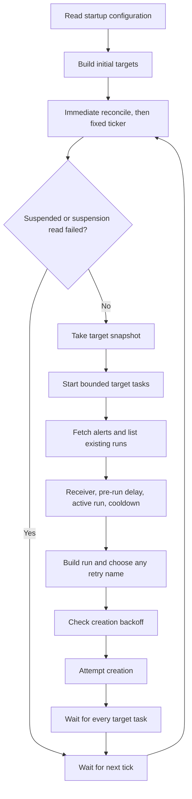

# Reconcile Flow

## Module Map

| File | Key symbols | Role |
|---|---|---|
| `cmd/alerts-adapter/main.go` | `main`, `newTargets`, `startSpokeClusterController` | Load settings, create clients, discover targets, start workers |
| `internal/config/config.go` | `LoadFromFile`, `DefaultConfigPath` | Parse the startup file and apply defaults |
| `internal/adapter/adapter.go` | `Run`, `reconcile`, `reconcileTarget` | Schedule cycles and process each target |
| `internal/agenticrun/build.go` | `BuildForTarget`, `StableFingerprint`, `NextAvailableName` | Build run metadata and request |
| `internal/multicluster/registry.go` | `Registry`, `Targets` | Protect the target map and return snapshots |
| `internal/multicluster/controller.go` | `Reconcile` | Rebuild or remove targets after SpokeCluster events |

## Data Flow

`main` loads `/etc/alerts-adapter/config.yaml` once. Invalid YAML or duration syntax exits before client setup. `Adapter` holds a `config.Config` value; there is no configuration source interface or reload path.

`Run` calls `reconcile` immediately, then creates a ticker. Each reconcile reads the suspension state, performs backoff garbage collection, and takes a registry snapshot. A semaphore bounds target goroutines. Each task gets a context with a deadline of `pollInterval`; a wait group prevents overlapping cycles. Ticker events can be delayed or dropped when work is slow, so this is not a guaranteed delay after each completed cycle.

Within a target, alerts are processed in sequence. Retrieval or listing failure ends that target's work. A build or creation failure normally skips only that alert; timeout or cancellation ends the target task. Successful creation appends the run to the local list so another alert in the same group is blocked during that cycle.

## Key Abstractions

- `AlertSource`, `AgenticRunClient`, and `SuspensionSource` provide external reads and writes.
- `TargetSource` provides a snapshot. The registry combines fixed local targets with spoke targets behind a mutex.
- `flowcontrol.Backoff` holds creation failures by target name and stable group hash. Delays grow from one minute to ten minutes. A nil creation error clears the entry, including AlreadyExists. Process restart clears all entries.
- `BuildForTarget` renders `request.tmpl` with selected, sanitized alert fields. Agent selection uses step override, global override, then `default`.
- Names use alert name, optional namespace, and the first eight hex characters of SHA-256 over UTC RFC 3339 startsAt plus the target identity when present. Stable group hashes use sorted labels with ignored labels removed. The two hashes have different roles.

## Integration Points

| Consumer | Provider | Mechanism |
|---|---|---|
| Adapter startup | Deployment owner | YAML file mounted at `/etc/alerts-adapter/config.yaml` |
| Poll loop | AlertManager | Authenticated HTTPS requests through the generated API client |
| Poll loop | Kubernetes | List/create AgenticRuns and read suspension state |
| Target controller | Hub resources | Watch SpokeClusters and read referenced credential Secrets |

## Implementation Notes

- A registry update affects later snapshots. It does not cancel tasks from an earlier snapshot.
- The controller watches SpokeClusters only. Credential Secret changes and connection failures do not directly trigger a refresh. A later SpokeCluster reconcile or process restart reloads credentials.
- Single-cluster local listing and multicluster local listing use different label filters. Switching modes can lose local deduplication history; [building rule 31a](../what/agenticrun-building.md#agenticrun-crud) records the missing compatibility.
- `terminalTime` maps Completed to Verified. It currently misses Completed runs produced by Analyzed with reason NoActionRequired; see [polling rule 25a](../what/poll-loop.md#post-run-delay-cooldown).
- `buildName` shortens only the alert-name component and can exceed 63 characters for long namespaces. [Building rule 16a](../what/agenticrun-building.md#metadata-sanitization) records the remaining requirement.
- `requestData.Summary` is populated but not used by `request.tmpl`. Summary is stored in metadata; description is included in the request.
- Clearing cooldown does not change a deterministic name. An existing base name still causes AlreadyExists unless the EmergencyStopped replacement path chooses a retry name.
