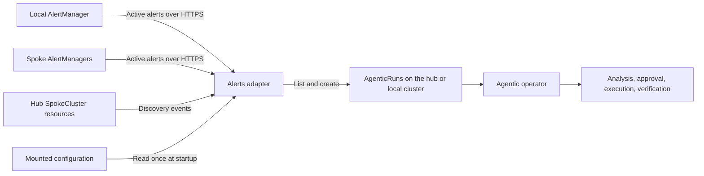
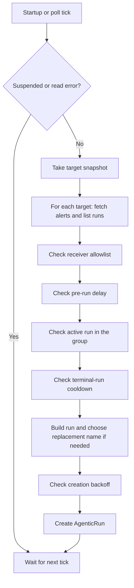

# Alerts Adapter Architecture

The adapter connects OpenShift alerts to the Lightspeed Agentic workflow. It polls AlertManager, filters alerts, checks existing `AgenticRun` resources, and creates a run when an alert is eligible. The agentic operator owns analysis, approval, execution, verification, and cleanup after creation.

The adapter is a Go process with one replica and no persistent storage. It keeps discovered targets and creation backoff in memory. Current behavior and planned corrections are defined in [.ai/spec/](.ai/spec/README.md); the [code map](.ai/spec/how/project-structure.md) and [reconcile guide](.ai/spec/how/reconcile-flow.md) explain the implementation.

## Components and Deployment

The classic Lightspeed operator deploys the local adapter when `OLSConfig.spec.ols.deployment.alertsAdapter.configMapRef` is set. It mounts the referenced ConfigMap and restarts the adapter when configuration changes. The hub operator deploys its own `lightspeed-hub-alerts-adapter` with `--multicluster` and `ALERTMANAGER_URL=""`, which disables local polling. Both deployments can exist on the same hub.

The adapter can also be deployed directly with [manifests/](manifests/). This deployment mounts `alerts-adapter-config` and requires that ConfigMap to exist. Changes to its data need a manual rollout restart. `POD_NAMESPACE` selects the namespace for runs and spoke credential Secrets; it defaults to `openshift-lightspeed`.

The process does not modify or delete existing runs. If an alert resolves while a run is active, the run continues under the agentic operator. A resolved alert may still have a root cause worth investigating.

## Polling and Recovery

AlertManager provides the active alert set after silencing and inhibition. Prometheus and Thanos evaluate alert rules upstream. Reading AlertManager lets the adapter use the existing notification routes and suppression rules.

The process polls immediately at startup. It can see alerts still firing after downtime without waiting for a new notification. It cannot recover alerts that fired and resolved entirely while it was stopped. Operators must configure the receiver allowlist; the default empty list skips all alerts.

Every cycle reads the `AgenticOLSConfig` singleton named `cluster`. A true `spec.suspended` skips the cycle before alert or run operations. Missing CRD or singleton means suspension is disabled; other read errors skip the cycle and are retried on the next poll.

Each failed check skips that alert. There is no separate severity filter. In multicluster mode, target tasks run concurrently with a default limit of four. Alerts within a target run in sequence, and the next cycle waits for all started tasks. Every target gets a deadline equal to `pollInterval`. A target failure does not stop healthy targets.

The controller lists SpokeClusters at startup and watches later changes. It replaces or removes targets in a shared registry. Each poll uses a snapshot of that registry. Removing a target affects later snapshots; work already started can finish or reach its deadline.

Remote credentials are read when a target is built. A later SpokeCluster reconciliation or process restart reloads them. The current code does not watch credential Secrets or reload them after connection errors. See the [multicluster spec](.ai/spec/what/multicluster.md) for the current rules and open refresh requirement. The CA and spoke-identity integration decisions remain open in the parent and child specs.

## Deduplication and State

Each target compares current alerts with its existing AgenticRuns. The stable group ID hashes sorted alert labels after removing the configured ignored labels. The default ignored labels are `pod`, `instance`, `endpoint`, and `uid`.

Several alerts can share a group. An active run blocks another run for that group, including within the same cycle: a newly created run is added to the list used by later checks. The original AlertManager fingerprint is kept separately for traceability. This does not promise one run per alert.

| Setting | Default | Effect |
|---|---|---|
| `preRunDelay` | `0s` | Wait until an alert has fired long enough |
| `postRunDelay` | `1h` | Delay new attempts after a terminal run in the same group |
| Creation backoff | 1 minute to 10 minutes | Delay repeated creation failures for a target and group |

Completed, Failed, Denied, Escalated, and EmergencyStopped are terminal phases. Analysis with `NoActionRequired` also derives as Completed. The current cooldown code misses that analysis-only completion because it looks for a Verified condition. This is an open implementation gap, recorded in [polling rule 25a](.ai/spec/what/poll-loop.md#post-run-delay-cooldown).

Backoff is kept in memory and clears on restart. A successful creation or AlreadyExists clears the group's backoff. Retrieval, listing, and build errors do not advance creation backoff. Unused backoff entries may expire.

Deterministic names prevent duplicate creation of the same named run. They do not provide a lock for an entire stable alert group across concurrent replicas. The supported deployment uses one replica.

## Building AgenticRuns

Names use `{alertname}-{namespace}-{startsAt_hash}`, or omit the namespace component when the alert has none. The hash is the first eight hex characters of SHA-256 over the UTC RFC 3339 start time and, for a spoke target, its target identity. Name components are lowercased and sanitized.

The desired name limit is 63 characters because the operator uses run names as label values. The current builder shortens only the alertname, so a long namespace can still exceed the limit. [Building rule 16a](.ai/spec/what/agenticrun-building.md#metadata-sanitization) records this gap.

Passing cooldown allows an attempt; it does not change the name. An existing name still causes AlreadyExists. An eligible alert whose base name belongs to an EmergencyStopped run can use the next available deterministic `-retry-N` name.

| Run field | Source |
|---|---|
| `metadata.namespace` | Adapter namespace, default `openshift-lightspeed` |
| `spec.targetNamespaces` | Alert namespace, if present |
| `spec.request` | Alert name, severity, namespace, description, optional runbook URL, and investigation instruction |
| `spec.analysis.agent` | `agent.analysis`, then `agent.default`, then `default` |
| `spec.execution.agent` | `agent.execution`, then `agent.default`, then `default` |
| `spec.verification.agent` | `agent.verification`, then `agent.default`, then `default` |
| `spec.tools.skills` | Valid entries from `tools.skills` |

The request uses [request.tmpl](internal/agenticrun/request.tmpl). It receives selected fields, not the full label map. Alert text is sanitized to remove control characters except newlines, Unicode format characters, and runs of at least three backticks. Configured skill paths appear with an `/app` prefix; otherwise the request uses the generic investigation instruction.

Summary is stored in an annotation, limited to 256 bytes; it is not rendered in the request. Metadata also includes the source, original fingerprint, stable group ID, alert name, severity, and start time. The [building spec](.ai/spec/what/agenticrun-building.md#output-metadata) defines this contract.

## Configuration and Access

The process reads `/etc/alerts-adapter/config.yaml` once before starting. Missing files use defaults. Invalid YAML, invalid duration syntax, and other file read errors fail startup. Non-positive poll intervals log an error and use 30 seconds; non-positive pre-run and post-run delays become zero. See [configuration](.ai/spec/what/configuration.md) for all fields and defaults.

Local AlertManager access uses the pod's ServiceAccount token, read on each request, and the service CA file for TLS. `ALERTMANAGER_URL` overrides the default service endpoint. Remote targets use credentials supplied through SpokeCluster discovery.

The deployment needs permission to create/list runs in its namespace, read the suspension singleton, and access local AlertManager when enabled. Multicluster mode also needs list/watch/get access to SpokeClusters and get access to credential Secrets. [manifests/rbac.yaml](manifests/rbac.yaml) contains the direct deployment permissions.

## Logs and Errors

| Level | Events |
|---|---|
| Info | Startup settings, suspension, completed cycle totals, run creation, AlreadyExists, backoff cleared, shutdown |
| Warning | Invalid skill entries and creation failures entering or increasing backoff |
| Error | Startup failures, suspension reads, alert retrieval, run listing, and run building failures |
| Debug | Cycle start and per-alert filter skips |

Missing fingerprints or start timestamps cause a build error. Retrieval or listing errors stop that target's cycle. Other alert failures allow the next alert to be processed unless the target deadline or process cancellation ends the task. Default Info logging does not print details for every retrieved alert.

There is currently no HTTP health/readiness endpoint or Prometheus metrics endpoint. SIGTERM and SIGINT cancel ongoing work and stop the process cleanly.

## Future Options

These are design options, not claims about current behavior:

- Use AlertManager grouping metadata in addition to the existing stable label groups.
- Configure delays, agents, or workflow choices per alert group.
- Add label-selector filtering.
- Add health endpoints and Prometheus metrics for polls, creations, errors, and cycle duration.
- Define adapter-specific analysis output for alert correlation and affected services.
- Support multiple replicas with explicit coordination or sharding.
- Limit creation rates and model costs during alert storms.
- Add backoff for repeated alert build failures.

Known implementation gaps are listed next to the affected requirements in [.ai/spec/README.md](.ai/spec/README.md#open-work).
